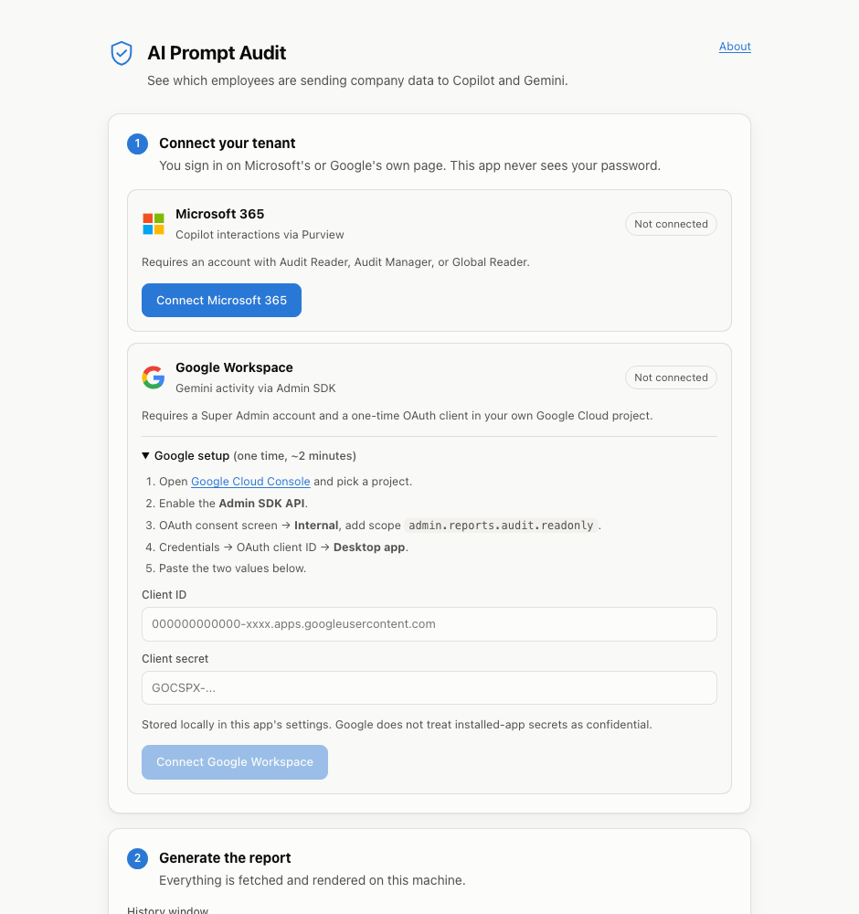
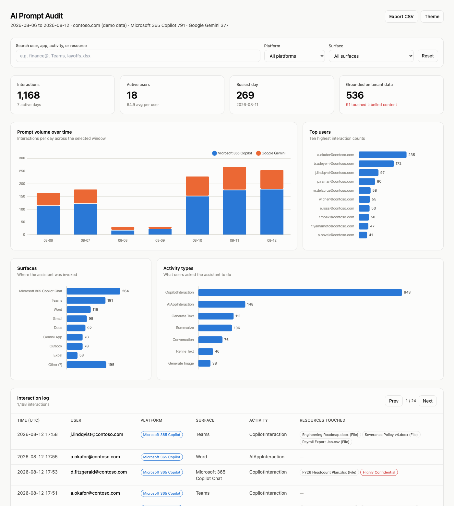

# SecuriX AI Audit

**See every Copilot and Gemini prompt in your tenant — without sending a single byte to anyone.**

A free, open-source desktop app for enterprise IT admins. It signs into *your* Microsoft 365
or Google Workspace tenant with *your* admin credentials, pulls the AI prompt audit logs, and
writes a self-contained HTML dashboard to your Documents folder.

Ships as a `.dmg` and a `.exe`. There is also a CLI for people who prefer one.





> **There is no password field, and there never will be.** Sign-in happens on Microsoft's and
> Google's own pages via OAuth; the app receives a scoped, read-only, expiring token and never
> sees a credential. Any tool that asks an admin to type a tenant password into a downloaded
> binary is indistinguishable from a phishing kit — and would not work anyway, since MFA and
> Conditional Access block password grants.

---

## Why this exists

Most organisations turned on Microsoft 365 Copilot or Gemini for Workspace without a
way to answer three questions their auditors are about to ask:

1. **Who is actually using it?** Licence counts are not usage.
2. **What tenant data is the assistant reading?** Copilot grounds answers on SharePoint,
   OneDrive, and mailbox content — the audit log names those files.
3. **Is it touching classified material?** Sensitivity labels on grounded resources are
   in the log, and nobody is looking at them.

The data is already in Purview and the Admin SDK. The gap is that getting at it means
an async Graph API, a paginated Reports API, and a spreadsheet afternoon. This closes
that gap in one command.

## Zero-trust by construction

This tool is asking for audit-read across your whole tenant, so it should have to earn that.

| Property | How it is enforced |
|---|---|
| **No third-party server** | There is no backend, no telemetry, no licence check, no update ping — nothing is sent to SecuriX, ever. Both the app and the CLI contact exactly six hosts, all first-party: `login.microsoftonline.com`, `graph.microsoft.com`, `accounts.google.com`, `oauth2.googleapis.com`, `openidconnect.googleapis.com` (one cosmetic "signed in as" lookup), and `admin.googleapis.com`. Point a proxy at it and check. |
| **No secrets on disk by default** | Tokens live in process memory and die with the process. Persistence is opt-in: the app's **Stay signed in** encrypts them via `safeStorage` (macOS Keychain / Windows DPAPI / libsecret); the CLI's `--save-session` writes a `0600` file. Off by default either way, because a Global Admin refresh token at rest is a standing credential, not a one-shot report. |
| **Read-only scopes** | `AuditLogsQuery.Read.All` and `admin.reports.audit.readonly`. Neither can mutate tenant state. |
| **PKCE on every flow** | S256 code challenges, constant-time `state` validation, loopback listener bound to `127.0.0.1` and torn down after one callback. |
| **Consent is revocable and visible** | The desktop app authenticates through a multi-tenant Entra application published by SecuriX, so you can see exactly what you granted under *Enterprise applications* and revoke it there at any time. Prefer to own the registration outright? The CLI uses your own app id and shares no identity with SecuriX. |
| **No prompt content** | Prompt and response bodies are never mapped into the report. `--include-raw` attaches full payloads to the `--json` stream only; the HTML never embeds them. |
| **Hardened renderer** | The UI runs `sandbox: true`, `contextIsolation: true`, `nodeIntegration: false`, behind a CSP with `connect-src 'none'` — it cannot make a network request or touch the filesystem. Every outbound call originates in the main process against a fixed host list. |
| **OAuth in the real browser** | Sign-in opens your system browser, never an embedded webview. You can see the address bar and verify you are on `login.microsoftonline.com`. Embedded-webview OAuth is the phishing pattern, and Google blocks it outright. |
| **Zero dependencies** | The runtime `dependencies` block in `package.json` is empty — Electron and the build tooling are dev dependencies. Nothing to audit but this repo. |

The generated HTML embeds your audit records, so it is written `0600` and should be
handled with the same rules as the audit log itself.

**One honest caveat about the report:** the HTML loads Tailwind from
`cdn.tailwindcss.com` and Chart.js from `cdn.jsdelivr.net` when you open it, both pinned
to exact versions. Your audit data is never sent anywhere — these are inbound script
fetches — but they are two requests your browser makes to hosts you did not choose. Open
the file on an air-gapped machine and it still renders: you get the tables, the numbers,
and the KPI tiles, with the charts absent. If you would rather have no external requests
at all, vendor both libraries into `TEMPLATE` in [`src/report.ts`](src/report.ts).

---

---

## Linux clients

Fully supported. The app is the same Electron binary; only packaging and one
storage detail differ.

| Format | Arch | Notes |
|---|---|---|
| **AppImage** | x64, arm64 | Recommended. `chmod +x` and run — no installation, no root, works on every mainstream distro. |
| **.deb** | x64, arm64 | Debian, Ubuntu, Mint. Installs a desktop entry. |
| **.rpm** | x64 | Fedora, RHEL, openSUSE. |

```bash
chmod +x "SecuriX AI Audit-0.1.0.AppImage"
./"SecuriX AI Audit-0.1.0.AppImage"
```

**Building them:** `npm run dist:linux`. On a Linux host that produces all three.
On macOS or Windows it produces **AppImage only** — `.deb` and `.rpm` are assembled
by `fpm`, which needs GNU `ar`, and macOS ships the BSD one (`ar failed (exit code
72)`). For the full set off-Linux, use the official container:

```bash
docker run --rm -v "$PWD":/project -w /project \
  electronuserland/builder:wine \
  /bin/bash -c "npm ci && npm run dist:linux"
```

### "Stay signed in" needs a keyring

This is the one behavioural difference, and it is deliberate. On macOS and
Windows, `safeStorage` is backed by Keychain and DPAPI. On Linux it needs
**gnome-keyring** or **kwallet** via libsecret — and when neither is present,
Chromium silently falls back to a `basic_text` backend that "encrypts" with a
*hardcoded key*, while still reporting encryption as available.

Storing a Global Admin refresh token under a hardcoded key is plaintext with
extra steps, so the app checks the actual backend and **refuses to persist**,
greying out the checkbox with the reason shown. Tokens stay in memory and die
with the process — which is the default on every platform anyway.

To enable it:

```bash
sudo apt install gnome-keyring libsecret-1-0     # Debian/Ubuntu
sudo dnf install gnome-keyring libsecret         # Fedora/RHEL
```

The `.deb` lists these under `Recommends`, so most desktop installs get them.

### Other Linux notes

- **Headless servers have no GUI.** Use the CLI there — `--ms-auth device` gives
  you a code to enter on any other device, which is why device-code flow is the
  CLI's default.
- **Sign-in needs a browser.** `xdg-open` is used; the URL is always printed as a
  fallback if it fails.
- **AppImage needs FUSE.** Most distros have it; on Ubuntu 22.04+ install
  `libfuse2` if you get a mount error. Or extract: `./App.AppImage --appimage-extract`.
- **Sandbox errors** (`SUID sandbox helper`) happen in some containers and minimal
  distros. `--no-sandbox` works around it but weakens the renderer isolation this
  app relies on; prefer fixing the host.

---

## Two ways to run it

### Desktop app (recommended)

Download the installer, open it, click **Connect Microsoft 365**. That is the whole flow —
no app registration, because SecuriX ships a multi-tenant Entra application you simply
consent to.

```bash
# building it yourself
npm install
export SECURIX_ENTRA_CLIENT_ID="<your multi-tenant app id>"   # see DISTRIBUTION.md
npm run app          # build + launch
npm run dist:mac     # -> release/*.dmg
npm run dist:win     # -> release/*.exe
npm run dist:linux   # -> release/*.AppImage (+ .deb/.rpm on Linux)
```

Without `SECURIX_ENTRA_CLIENT_ID` the app still builds and runs, but shows a
"not configured" banner and disables Microsoft sign-in. Google onboarding is
bring-your-own either way — see below for why.

**Just want to try it?** [TESTING.md](TESTING.md) — `npm install && npm run app`, then
click *Preview with sample data*. No credentials, no `.env`, no network.

**Publishing this as a lead magnet?** [DISTRIBUTION.md](DISTRIBUTION.md) covers the Entra
registration, code signing and notarization, and the website download flow.

### CLI

```bash
npx ai-audit-lens --demo          # preview with synthetic data
```

The CLI requires its own Entra app registration (walkthrough below) because it is not
distributed with SecuriX's client id.

---

## Setup

Pick one or both clouds. Each takes about two minutes, once.

These walkthroughs are for **the CLI**. The desktop app needs none of the Microsoft steps.

<details open>
<summary><b>Microsoft 365 Copilot — Entra ID app registration (CLI only)</b></summary>

**Prerequisites:** a licence that includes Purview Audit (most M365 E3/E5 and Business
Premium plans), unified auditing enabled, and an account with **Audit Reader**,
**Audit Manager**, or **Global Reader**.

1. [Entra admin center](https://entra.microsoft.com) → **Applications** → **App registrations** → **New registration**.
2. Name it `AI Audit Lens`. Supported account types: **Single tenant**. Skip the redirect URI. **Register**.
3. Copy the **Application (client) ID** and **Directory (tenant) ID** from the Overview page.
4. **API permissions** → **Add a permission** → **Microsoft Graph** → **Delegated permissions**
   → search `AuditLogsQuery` → tick **AuditLogsQuery.Read.All** → **Add**.
5. Click **Grant admin consent for \<your tenant\>**. This is required; the tool cannot consent for you.
6. **Authentication** → scroll to **Advanced settings** → set **Allow public client flows** to **Yes** → **Save**.

```bash
npx ai-audit-lens --ms-tenant <tenant-id> --ms-client-id <client-id>
```

You will get a device code to enter at `microsoft.com/devicelogin`. Prefer a browser
redirect instead? Add `--ms-auth browser`, and register
`http://localhost:3000/callback` as a **Mobile and desktop applications** redirect URI
in step 2.

</details>

<details open>
<summary><b>Google Gemini for Workspace — OAuth client (both the app and the CLI)</b></summary>

**Prerequisites:** a Gemini for Workspace licence (Gemini audit logging began
**2025-06-20**; earlier windows return nothing), and a **Super Admin** account.

1. [Google Cloud Console](https://console.cloud.google.com) → create or select a project.
2. **APIs & Services** → **Library** → search **Admin SDK API** → **Enable**.
3. **APIs & Services** → **OAuth consent screen** → **Internal** → fill in the app name and support email.
4. On **Scopes**, add `https://www.googleapis.com/auth/admin.reports.audit.readonly`.
5. **Credentials** → **Create credentials** → **OAuth client ID** → Application type: **Desktop app**.
6. Copy the **Client ID** and **Client secret**.

```bash
npx ai-audit-lens --google-client-id <id> --google-client-secret <secret>
```

Your browser opens for consent; the callback returns to a loopback listener on this machine.

> Google's client secret for a Desktop app is [not treated as confidential](https://developers.google.com/identity/protocols/oauth2#installed) —
> it identifies the app, it does not authorise it. This tool never writes it to disk.

</details>

Both configured? Run them together:

```bash
npx ai-audit-lens --provider both \
  --ms-tenant "$AZURE_TENANT_ID" --ms-client-id "$AZURE_CLIENT_ID" \
  --google-client-id "$GOOGLE_CLIENT_ID" --google-client-secret "$GOOGLE_CLIENT_SECRET"
```

Credentials can also come from the environment: `AZURE_TENANT_ID`, `AZURE_CLIENT_ID`,
`GOOGLE_CLIENT_ID`, `GOOGLE_CLIENT_SECRET`.

---

## Usage

```
ai-audit-lens [options]
```

| Option | Default | Notes |
|---|---|---|
| `--days <n>` | `7` | History window. Both clouds retain ~180 days. |
| `--provider <p>` | auto | `microsoft`, `google`, or `both`. Defaults to whatever is configured. |
| `--out <path>` | `./ai-audit-report-<date>.html` | |
| `--timeout <minutes>` | `15` | Overall deadline, including the Purview wait. |
| `--max-records <n>` | `50000` | Per-provider collection cap. |
| `--no-open` | | Do not launch the browser at the end. |
| `--json` | | Also emit normalised events to stdout (stderr carries the progress log, so `> events.json` is clean). |
| `--pseudonymize` | | Replace identities with per-run aliases and drop IPs. For works-council / GDPR contexts. The mapping is never written anywhere. |
| `--include-raw` | | Attach untouched provider payloads to `--json`. Not embedded in the HTML — raw records dwarf the report and would make it unopenable. |
| `--save-session` | | Cache refresh tokens `0600` under `~/.ai-audit-lens`. |
| `--verbose` | | Log every URL, status code, and retry decision. |
| `--demo` | | Synthetic report. No network, no auth. |

### About the Purview wait

The Microsoft side is an **asynchronous** API: you create a query, then poll it until the
service has finished searching. On a small tenant that is under a minute. On a large one
it is commonly 5–20 minutes, and it is not unusual for a 7-day query to exceed the
15-minute default deadline. That is a property of Purview, not of this tool.

When the deadline hits, the query keeps running server-side and the tool prints its id:

```bash
ai-audit-lens --provider microsoft --ms-query-id 168ec429-084b-a489-90d8-504a87846305
```

That resumes from the finished query and skips the wait entirely. Raise `--timeout 30`
if you would rather just wait it out.

### Why `operationFilters` and not `recordTypeFilters`

Filtering the unified audit log for Copilot looks like it should use
`recordTypeFilters: ["copilotInteraction"]`. It does not work: that property is typed as
the Graph `auditLogRecordType` enum, and **that enum has no Copilot member in v1.0** —
sending one returns `400`. Copilot records are selected by `operationFilters` instead
(`CopilotInteraction` for the core surfaces, `AIAppInteraction` for newer agent
surfaces), which is an unconstrained string collection.

If Microsoft renames these, override without waiting for a release:

```bash
ai-audit-lens --ms-operations CopilotInteraction,AIAppInteraction,SomeNewOperation
```

The same escape hatch exists for Google: `--google-apps gemini_in_workspace_apps,...`.

---

## What the report shows

A single HTML file, openable offline (Tailwind and Chart.js load from CDN; everything
else is inline), that works in light and dark mode:

- **KPI tiles** — total interactions, active users, busiest day, and how many
  interactions were *grounded on tenant data* with a count of those touching
  sensitivity-labelled content.
- **Prompt volume over time** — daily interactions, split by platform when both are present.
- **Top users** — the ten heaviest users.
- **Surfaces** and **Activity types** — where the assistant was invoked and what it was asked to do.
- **Interaction log** — searchable, sortable, paginated, with the grounded resources per
  row and CSV export (generated in-browser; nothing is uploaded).

Every filter re-scopes the whole page, so the charts and the table never disagree.

---

## Building a distributable executable

Three options, in the order most people should reach for them.

### 1. Bun — a true single-file binary (recommended)

Bun embeds its own runtime, so the recipient needs nothing installed. This is the right
choice for a tool you hand to an admin who will not run `npm install`.

```bash
npm install                                 # dev deps only; there are no runtime deps
npm run build:bun                           # current platform -> dist-bin/ai-audit-lens
node scripts/build-binaries.mjs             # all platforms
node scripts/build-binaries.mjs windows-x64 linux-x64   # or pick targets
```

Targets: `darwin-arm64`, `darwin-x64`, `windows-x64`, `linux-x64`, `linux-arm64`.
Output lands in `dist-bin/` as `ai-audit-lens-<version>-<platform>[.exe]`. Expect ~57 MB
for a native build and ~100–110 MB for cross-compiled targets, which carry unstripped
debug symbols. That is the embedded Bun runtime; it does not vary with your code. Compress
before distributing — these gzip to roughly a third.

**Signing matters more than the build.** An unsigned binary downloaded from the internet
is exactly the thing you are teaching admins not to run:

```bash
# macOS — needs an Apple Developer ID
codesign --force --options runtime --timestamp \
  --sign "Developer ID Application: Your Org (TEAMID)" dist-bin/ai-audit-lens-0.1.0-macos-arm64
xcrun notarytool submit dist-bin/ai-audit-lens-0.1.0-macos-arm64.zip \
  --apple-id you@example.com --team-id TEAMID --wait
xcrun stapler staple dist-bin/ai-audit-lens-0.1.0-macos-arm64

# Windows — needs an EV or OV code-signing certificate
signtool sign /tr http://timestamp.digicert.com /td sha256 /fd sha256 \
  /a dist-bin/ai-audit-lens-0.1.0-windows-x64.exe
```

Ship SHA-256 sums alongside the downloads:

```bash
shasum -a 256 dist-bin/* > dist-bin/SHA256SUMS.txt
```

### 2. Node SEA — no Bun, but Node 20+ on the build machine

Node's Single Executable Application support needs a **CommonJS** entry, which is what
`npm run bundle` produces.

```bash
npm run bundle                              # -> dist-cjs/ai-audit-lens.cjs (~94 KB)
cat > sea-config.json <<'JSON'
{ "main": "dist-cjs/ai-audit-lens.cjs", "output": "build/sea-prep.blob", "disableExperimentalSEAWarning": true }
JSON
node --experimental-sea-config sea-config.json
cp "$(command -v node)" build/ai-audit-lens
npx postject build/ai-audit-lens NODE_SEA_BLOB build/sea-prep.blob \
  --sentinel-fuse NODE_SEA_FUSE_fce680ab2cc467b6e072b8b5df1996b2
```

On macOS you must strip the existing signature before injecting (`codesign --remove-signature`)
and re-sign afterwards.

### 3. `pkg` — legacy, only if you are pinned to it

The original `vercel/pkg` is archived and does not handle modern ESM. Use the maintained
fork against the CommonJS bundle:

```bash
npm run bundle
npx @yao-pkg/pkg dist-cjs/ai-audit-lens.cjs \
  --targets node20-macos-arm64,node20-win-x64,node20-linux-x64 --out-path dist-bin
```

### Or just publish to npm

`npx` is the lowest-friction path for anyone who already has Node, and it sidesteps
code-signing entirely:

```bash
npm run build && npm publish --access public
```

`files` is scoped to `dist/`, so the published package is the compiled JS and nothing else.

---

## Troubleshooting

| Symptom | Cause and fix |
|---|---|
| `403` on the Microsoft side | Three things must all be true: `AuditLogsQuery.Read.All` is **admin-consented**, the signed-in account holds Audit Reader / Audit Manager / Global Reader, and the tenant is licensed for Purview Audit. |
| `Could not start device sign-in` | **Allow public client flows** is still **No** on the app registration. |
| Purview query succeeds with 0 records | Unified auditing may be off, or nobody used Copilot in the window. Widen with `--days 30`. |
| `404` on `/security/auditLog/queries` | The Audit Search API is unavailable in US Gov L4/L5 and 21Vianet clouds. Use `Search-UnifiedAuditLog` in Exchange Online PowerShell there. |
| `403` on the Google side | Sign in as a **Super Admin**, confirm the Admin SDK API is enabled in the backing Cloud project, and that the consent screen grants the reports scope. |
| Google returns nothing | Gemini logging starts **2025-06-20** and requires a Gemini for Workspace licence. An unlicensed tenant logs nothing at all. |
| Hangs behind a corporate proxy | Set `HTTPS_PROXY`, and `NODE_EXTRA_CA_CERTS=/path/to/corp-root.pem` if TLS is inspected. |
| Report is enormous | Lower `--max-records`, or narrow `--days`. Above 50 000 events the charts cover the most recent slice and the report says so. |

Stack traces: `AI_AUDIT_LENS_DEBUG=1 ai-audit-lens ...`

## Project layout

```
src/               core — shared by both front ends, no Electron imports
  run.ts           orchestration: auth -> collect -> normalise -> render
  auth.ts          Entra device-code + loopback PKCE; Google loopback PKCE
  fetch.ts         Purview async query lifecycle; Reports API pagination
  normalize.ts     Provider records -> unified PromptEvent (schema-drift tolerant)
  report.ts        Dictionary-encoded payload + the HTML dashboard template
  http.ts          Retry, backoff with jitter, Retry-After, deadlines, cancellation
  brand.ts         Product identity + the multi-tenant Entra client id
  demo.ts          Seeded synthetic dataset for --demo
  log.ts           Logger with a pluggable sink (stderr for CLI, IPC for the app)
  types.ts         Shared domain types
  index.ts         CLI front end: arg parsing and terminal presentation only

electron/
  main.ts          Window, hardening, IPC handlers, keychain session store
  preload.ts       The contextBridge trust boundary

ui/                renderer: plain HTML/CSS/JS, shipped verbatim, no build step
  index.html  app.css  app.js

scripts/
  build-app.mjs      esbuild bundle for main + preload
  start-app.mjs      dev launcher (strips ELECTRON_RUN_AS_NODE)
  make-icon.mjs      renders build/icon.png
  build-binaries.mjs bun cross-compile for the CLI
```

Both front ends call the same `runAudit()` in `src/run.ts`, so the GUI and the CLI
cannot drift apart on partial failures, deadlines, or redaction.

```bash
npm run typecheck   # tsc --noEmit across src/ + electron/
npm run app         # build and launch the desktop app
npm run dist:mac    # -> release/*.dmg
npm run dist:win    # -> release/*.exe
npm run build       # -> dist/ (ESM CLI, what npx runs)
npm run bundle      # -> dist-cjs/ai-audit-lens.cjs (CJS, for SEA/pkg)
npm run cli -- --demo
```

Running from **VS Code's integrated terminal**? `npm run app` handles it — VS Code
exports `ELECTRON_RUN_AS_NODE=1`, which would otherwise make Electron boot as plain
Node and fail with `Cannot read properties of undefined (reading 'whenReady')`.
`scripts/start-app.mjs` strips it.

## Known limitations

- **Purview latency is the bottleneck**, not collection. See the resume flow above.
- **Copilot audit records name grounded resources, not prompt text.** Prompt and response
  content lives in the users' mailboxes and is reachable through eDiscovery, not here.
  That is a deliberate boundary.
- **Google exposes less detail than Microsoft.** `gemini_in_workspace_apps` carries the
  app, action, and feature source, but no equivalent of `AccessedResources` — so the
  "grounded on tenant data" tile is effectively Microsoft-only today.
- **No delegated / service-account mode.** This is an interactive admin tool by design.
  Domain-wide delegation would make it schedulable and is the obvious next step.

## Licence

MIT — see [LICENSE](LICENSE).

Not affiliated with, endorsed by, or sponsored by Microsoft or Google. "Microsoft 365
Copilot", "Microsoft Purview", "Google Workspace", and "Gemini" are trademarks of their
respective owners.
